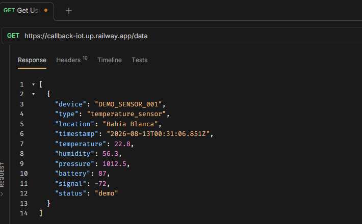
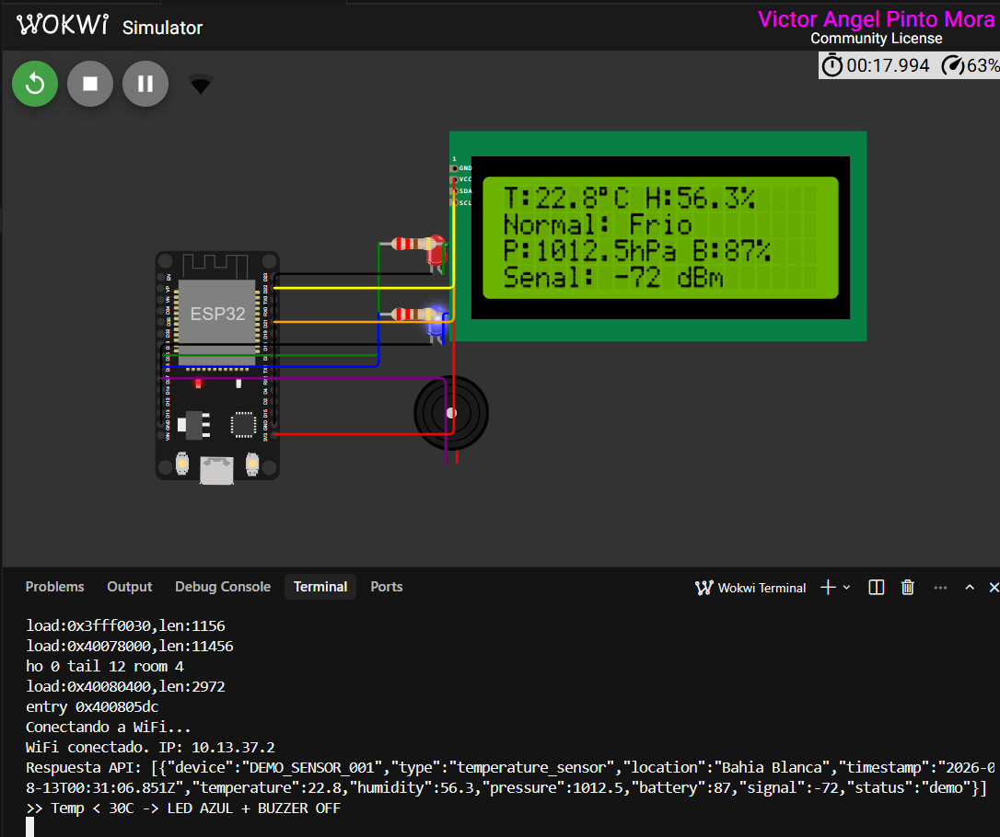

# Actividad 2 — Consumo de datos externos

En este laboratorio conecté un ESP32 a WiFi, consumí un endpoint HTTP y usé esos datos para controlar LEDs, un buzzer y una LCD 20x4.

## Código

El firmware está en `src/main.cpp`. Cada 5 s hago un `GET` a `https://callback-iot.up.railway.app/data`, parseo el JSON y actualizo la LCD y los actuadores.

## Capturas

Consulta previa del endpoint (Bruno):

Simulación en Wokwi (temp. 22.8 °C → LED azul, buzzer apagado):

## Explicación lógica

1. Me conecto a WiFi (`Wokwi-GUEST`).
2. Consumo el JSON. La API devuelve un **array**, así que tomo el objeto en el índice `[0]`.
3. Muestro temperatura, humedad, presión, batería y señal en la LCD.
4. Si `temperature > 30 °C` enciendo LED rojo y buzzer; si no, LED azul y buzzer apagado.
5. Si falla el WiFi, el HTTP o el parseo, muestro `Error API`.

## Reflexión

**¿Qué dificultades encontré al consumir datos desde un endpoint externo y cómo las resolví?**  
Al principio asumí que el JSON era un objeto, pero venía como array. Lo comprobé en Bruno y ajusté el parseo para leer `doc[0]`. También validé el código HTTP y el error de `deserializeJson` para no actuar con datos inválidos.

**¿Qué importancia tiene para un sistema IoT integrar datos de fuentes externas?**  
El dispositivo no necesita tener todos los sensores encima: puede reaccionar a datos de la nube u otros nodos. Eso permite monitoreo remoto y decisiones compartidas.

**¿Cómo aseguré que los datos fueran correctos y actualizados?**  
Consulté el endpoint a mano, imprimí el payload por Serial, verifiqué HTTP 200 y el parseo, y refresqué cada 5 s.

**¿Qué consideraciones de seguridad o confiabilidad tomé?**  
Usé HTTPS, comprobé que hubiera WiFi antes del `GET` y mostré un error en LCD si fallaba. El endpoint es público y sin autenticación: en un caso real haría falta un token y no bloquear el loop si la red cae.

**¿Qué mejoras agregaría?**  
Reintentos con backoff, guardar la última lectura válida, autenticación, timeout de la petición y alertas también por batería o señal baja.

## Video

