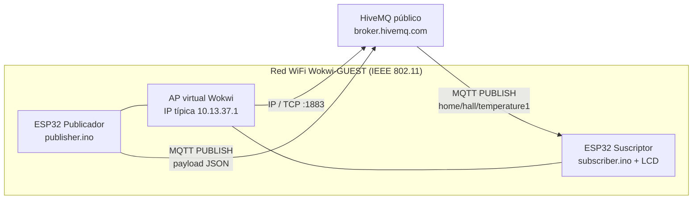

# Informe técnico — Red IoT MQTT (Publicador / Suscriptor)

**Laboratorio:** L5-A1  
**Plataforma:** ESP32 + Wokwi + PlatformIO  
**Broker:** HiveMQ público (`broker.hivemq.com:1883`)  
**Tópico:** `home/hall/temperature1`

---

## 1. Objetivo

Implementar una red IoT mínima con:

- una red WiFi (la red pública de Wokwi: `Wokwi-GUEST`);
- un broker MQTT público;
- un ESP32 **publicador** que genera datos simulados;
- un ESP32 **suscriptor** que consume esos datos y los muestra por serial y LCD.

Además se describe cómo capturar el tráfico con Wireshark/tshark y se analizan vulnerabilidades de la conexión.

---

## 2. Arquitectura y protocolos



### 2.1 Roles

| Nodo | Función |
|------|---------|
| ESP32 publicador | Se conecta a WiFi y al broker. Cada 4 s publica un JSON con temperatura y humedad simuladas. |
| ESP32 suscriptor | Se suscribe al mismo tópico. Imprime el payload en Serial y lo decodifica en el LCD. |
| Broker HiveMQ | Intermediario publish/subscribe. No guarda estado de la aplicación. |
| Cliente opcional Python | `tools/mqtt_subscriber.py` para verificar el canal sin el segundo ESP32. |

### 2.2 Pila de protocolos

| Capa | Protocolo | Observación en esta práctica |
|------|-----------|------------------------------|
| Enlace | Wi-Fi 802.11 | SSID `Wokwi-GUEST`, password vacía |
| Red | IPv4 | El ESP32 obtiene una IP tipo `10.13.37.2` (Wokwi) |
| Transporte | TCP | Puerto **1883** (MQTT sin TLS) |
| Aplicación | MQTT 3.1.1 | `CONNECT`, `SUBSCRIBE`, `PUBLISH`, `PINGREQ` |

No se usa MQTTS (`8883`) ni autenticación. El payload viaja en texto claro.

### 2.3 Mensaje publicado

```json
{"device":"pub-esp32-hall","temp":24.3,"hum":51.2,"unit":"C"}
```

---

## 3. Código fuente

Los sketches pedidos por el enunciado están en:

- Publicador: [`publisher/src/publisher.ino`](publisher/src/publisher.ino)
- Suscriptor: [`subscriber/src/subscriber.ino`](subscriber/src/subscriber.ino)
- Alternativa Python: [`tools/mqtt_subscriber.py`](tools/mqtt_subscriber.py)

Librerías: `WiFi`, `PubSubClient`, `LiquidCrystal_I2C`, `ArduinoJson`.

---

## 4. Cómo ejecutar y obtener capturas

### 4.1 Compilar

```powershell
cd publisher
pio run

cd ..\subscriber
pio run
```

### 4.2 Simular los dos controladores

Hay que levantar **dos** simulaciones Wokwi (dos ventanas o dos instancias):

1. Abrir `publisher/diagram.json` → Start simulation.
2. Abrir `subscriber/diagram.json` → Start simulation.

En el serial del publicador deben verse líneas `[PUB] topic=home/hall/temperature1 ... result=OK`.  
En el serial y el LCD del suscriptor deben verse la temperatura y la humedad recibidas.

Capturas a guardar en `docs/capturas/`:

- `serial-publicador.png`
- `serial-suscriptor.png`
- `lcd-suscriptor.png`

### 4.3 Cliente web HiveMQ (opcional)

1. https://www.hivemq.com/demos/websocket-client/
2. Host `broker.hivemq.com`, puerto WebSocket `8884`.
3. Subscribe a `home/hall/temperature1`.

### 4.4 Captura PCAP en Wokwi + Wireshark

1. Con la simulación **en ejecución**, pulsar el icono de **WiFi** del ESP32.
2. Descargar el archivo **PCAP**.
3. Abrirlo en [Wireshark](https://www.wireshark.org/).
4. Filtros útiles:

```
tcp.port == 1883
mqtt
ip.addr == 10.13.37.2
tcp.flags.syn == 1
```

En Wokwi la IP del dispositivo suele ser `10.13.37.2` (el enunciado cita `10.0.0.2` como ejemplo; usar la IP que muestre el serial).

**Qué se espera ver**

1. Handshake TCP (`SYN`, `SYN-ACK`, `ACK`) hacia la IP pública del broker.
2. MQTT `CONNECT` del ESP32 y `CONNACK` del broker.
3. En el suscriptor: `SUBSCRIBE` + `SUBACK`.
4. En el publicador: `PUBLISH` con el JSON **legible en claro**.
5. Keep-alive `PINGREQ` / `PINGRESP`.

### 4.5 tshark (opcional)

```powershell
tshark -r wokwi-wifi.pcap -Y "mqtt" -T fields -e ip.src -e ip.dst -e mqtt.msgtype -e mqtt.topic -e mqtt.msg
```

---

## 5. Análisis de vulnerabilidades

La práctica usa un **broker público, puerto 1883, sin usuario/contraseña y sin TLS**. Eso no es un “bug” del código: es el escenario típico de un laboratorio, y deja visibles varios riesgos reales.

### 5.1 Confidencialidad — tráfico en claro

Cualquiera con el PCAP (o en la misma red, en un escenario físico) lee el payload. En Wireshark, el campo MQTT Publish Message muestra `temp` y `hum` sin descifrar.

**Riesgo:** filtración de telemetría (o de claves, si alguien publicara secretos por el mismo canal).

### 5.2 MITM (Man-in-the-Middle)

Sin TLS no hay autenticación del servidor ni integridad del canal. Un atacante que intercepte o redirija el tráfico (ARP spoofing en una red real, DNS falso, proxy) puede:

- leer todos los `PUBLISH`;
- modificar temperatura/humedad antes de que lleguen al suscriptor;
- inyectar un `CONNACK` / mensajes falsos.

Wokwi aísla parcialmente la red del alumno, pero el tramo Internet hasta HiveMQ es MQTT plano.

### 5.3 Suplantación (spoofing) de publicador o suscriptor

El tópico `home/hall/temperature1` es público y predecible. Cualquier cliente MQTT en Internet puede:

- publicar JSON falsos con el mismo formato → el LCD mostraría datos inventados;
- suscribirse y copiar el flujo;
- reutilizar un `clientId` parecido (HiveMQ público no autentica identidad).

No hay lista de control de acceso (ACL) ni certificados de cliente.

### 5.4 DDoS / abuso del broker y de los dispositivos

- Inundar el tópico con `PUBLISH` grandes o a alta frecuencia (el ESP32 tiene poca RAM y `PubSubClient` un buffer chico).
- Abrir miles de conexiones TCP al broker público (abuso de un servicio compartido).
- `CONNECT` repetidos que agotan recursos del ESP32 (`reconnect` en loop).

El broker público de HiveMQ está pensado para pruebas, no para producción, y puede limitar o cortar clientes abusivos.

### 5.5 Replay

Un `PUBLISH` capturado se puede reenviar más tarde. No hay nonce, timestamp validado ni firma. El suscriptor acepta cualquier JSON bien formado.

### 5.6 Enumeración de tópicos

En brokers mal configurados se puede suscribir a `#` o `+` y descubrir canales ajenos. En HiveMQ público hay aislamiento relativo, pero **elegir un tópico genérico** aumenta la probabilidad de colisión con otros alumnos o de que alguien “se cuele” al mismo canal.

### 5.7 Contramedidas (producción)

| Problema | Mitigación |
|----------|------------|
| Texto claro | MQTTS puerto 8883 / TLS 1.2+ |
| Sin identidad | Usuario/password o certificados X.509 |
| Tópico abierto | ACL por cliente y tópico (`home/<user>/hall/temperature`) |
| Spoofing / replay | Payload firmado o nonce + timestamp |
| DDoS | Rate limit, autenticación, broker propio |
| Secretos en firmware | No hardcodear credenciales; usar partición NVS |

---

## 6. Reflexión

### Funcionamiento

El modelo pub/sub desacopla a los nodos: el publicador no conoce la IP del suscriptor. El broker enruta por **tópico**. Eso es el núcleo de muchas redes IoT (telemetría de sensores, comandos a actuadores).

En Wokwi la parte de red es real hacia Internet: el firmware usa la misma pila `WiFi` + TCP + MQTT que en una placa física. Por eso el PCAP es útil para ver `CONNECT`/`PUBLISH` de verdad.

### Dificultades

1. **Dos firmwares, dos simulaciones.** PlatformIO/Wokwi compilán un ELF por proyecto. Hay que abrir publicador y suscriptor por separado (o usar el script Python como segundo consumidor).
2. **Broker público compartido.** Si otro grupo usa el mismo tópico, aparecen mensajes ajenos. El nombre `home/hall/temperature1` es el del enunciado; en un lab real convendría sufijarlo con un id de grupo.
3. **1883 vs WebSocket 8884.** El ESP32 habla TCP 1883. El cliente web de HiveMQ usa WebSocket. Es el mismo broker, distinto transporte.
4. **Reconnect.** Si solo se llama `mqtt.connect()` en `setup()`, un corte deja el nodo mudo. El loop reintenta cada 3 s.
5. **LCD de 16 caracteres.** El tópico completo no cabe; se muestran `temp`/`hum` parseados con ArduinoJson.

### Conclusión de seguridad

La práctica demuestra que **“funciona” no equivale a “es seguro”**. Una captura de pocos paquetes basta para leer datos, impersonar al sensor y entender la arquitectura. Para un sistema real haría falta TLS, autenticación y tópicos no adivinables.

---

## 7. Referencias

- HiveMQ Public Broker: https://www.hivemq.com/mqtt/public-mqtt-broker/
- PubSubClient: https://www.luisllamas.es/en/send-receive-messages-mqtt-arduino-pubsubclient-library/
- Wokwi: https://wokwi.com/
- Wireshark SSL/TLS reference (contraste con MQTTS): https://www.wireshark.org/docs/dfref/s/ssl.html
