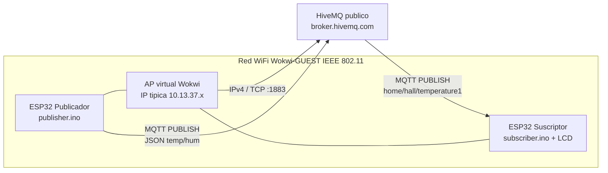

# Informe tecnico — Red IoT MQTT (Publicador / Suscriptor)

**Laboratorio:** L5-A1  
**Plataforma:** ESP32 + Wokwi + PlatformIO  
**Broker:** HiveMQ publico (`broker.hivemq.com:1883`)  
**Topico:** `home/hall/temperature1`

## Repositorio

- Repo: https://github.com/EgCooper/IoT-Labs
- Rama: `L5-A1`
- Publicador: [`publisher/src/publisher.ino`](publisher/src/publisher.ino)
- Suscriptor: [`subscriber/src/subscriber.ino`](subscriber/src/subscriber.ino)
- Suscriptor Python (opcional): [`tools/mqtt_subscriber.py`](tools/mqtt_subscriber.py)

---

## 1. Objetivo

Implementar una red IoT comprendida entre:

- una red WiFi publica de Wokwi (`Wokwi-GUEST`);
- un broker MQTT publico (HiveMQ);
- un controlador ESP32 **publicador**;
- un controlador ESP32 **suscriptor**;

para simular la publicacion y el consumo de datos (lecturas ficticias de temperatura y humedad).

El entregable incluye codigo fuente `.ino`, diagrama de arquitectura, guia de capturas (serial + Wireshark) y reflexion sobre vulnerabilidades.

---

## 2. Broker y topico de prueba

| Parametro | Valor |
|-----------|--------|
| Broker | `broker.hivemq.com` |
| Puerto ESP32 | `1883` (MQTT sin TLS) |
| Puerto cliente web HiveMQ | `8884` (WebSocket) |
| Topico | `home/hall/temperature1` |
| WiFi Wokwi | SSID `Wokwi-GUEST`, password vacia |

Referencia broker: https://www.hivemq.com/mqtt/public-mqtt-broker/

---

## 3. Arquitectura y protocolos



### 3.1 Roles

| Nodo | Funcion |
|------|---------|
| ESP32 publicador | Conecta WiFi + MQTT. Cada 4 s publica un JSON con temperatura y humedad simuladas. |
| ESP32 suscriptor | Se suscribe al mismo topico. Muestra el payload en Serial y en LCD I2C. |
| Broker HiveMQ | Intermediario publish/subscribe. |
| Python opcional | `tools/mqtt_subscriber.py` para verificar el canal sin el segundo ESP32. |

### 3.2 Pila de comunicacion

| Capa | Protocolo | En esta practica |
|------|-----------|------------------|
| Enlace | Wi-Fi 802.11 | `Wokwi-GUEST` |
| Red | IPv4 | IP tipica del ESP32 en Wokwi: `10.13.37.2` (el enunciado cita `10.0.0.2` como ejemplo) |
| Transporte | TCP | Puerto **1883** |
| Aplicacion | MQTT 3.1.1 | `CONNECT`, `SUBSCRIBE`, `PUBLISH`, `PINGREQ` |

No se usa MQTTS (`8883`) ni autenticacion. El payload viaja en texto claro.

### 3.3 Payload publicado

```json
{"device":"pub-esp32-hall","temp":24.3,"hum":51.2,"unit":"C"}
```

---

## 4. Codigo fuente

Sketches `.ino` pedidos por el enunciado:

- Publicador: [`publisher/src/publisher.ino`](publisher/src/publisher.ino)
- Suscriptor: [`subscriber/src/subscriber.ino`](subscriber/src/subscriber.ino)
- Alternativa Python: [`tools/mqtt_subscriber.py`](tools/mqtt_subscriber.py)

Bibliotecas: `WiFi`, `PubSubClient`, `LiquidCrystal_I2C`, `ArduinoJson`.

---

## 5. Ejecucion y capturas

### 5.1 Compilar

```powershell
cd publisher
pio run

cd ..\subscriber
pio run
```

### 5.2 Simular los dos controladores

1. Abrir `publisher/diagram.json` → Start simulation.
2. Abrir `subscriber/diagram.json` → Start simulation (otra instancia).

**Capturas Serial (guardar en `docs/capturas/`):**

- `serial-publicador.png` — lineas `[PUB] topic=home/hall/temperature1 ... result=OK`
- `serial-suscriptor.png` — lineas `[SUB] topic=... payload=...`
- `lcd-suscriptor.png` — LCD con Temp / Hum

### 5.3 HiveMQ Web Client (opcional)

1. https://www.hivemq.com/demos/websocket-client/
2. Host `broker.hivemq.com`, puerto `8884`.
3. Subscribe a `home/hall/temperature1`.

### 5.4 PCAP en Wokwi + Wireshark

1. Con la simulacion en ejecucion, pulsar el icono **WiFi** del ESP32.
2. Descargar el archivo **PCAP**.
3. Abrirlo en [Wireshark](https://www.wireshark.org/).
4. Filtros utiles:

```
tcp.port == 1883
mqtt
ip.addr == 10.13.37.2
tcp.flags.syn == 1
```

**Que se espera ver**

1. Handshake TCP (`SYN`, `SYN-ACK`, `ACK`) hacia el broker.
2. MQTT `CONNECT` y `CONNACK`.
3. En el suscriptor: `SUBSCRIBE` + `SUBACK`.
4. En el publicador: `PUBLISH` con el JSON **legible en claro**.
5. Keep-alive `PINGREQ` / `PINGRESP`.

Capturas sugeridas: `wireshark-tcp.png`, `wireshark-mqtt.png`.

### 5.5 tshark (opcional)

```powershell
tshark -r wokwi-wifi.pcap -Y "mqtt" -T fields -e ip.src -e ip.dst -e mqtt.msgtype -e mqtt.topic -e mqtt.msg
```

---

## 6. Vulnerabilidades encontradas

La practica usa un **broker publico, puerto 1883, sin usuario/contraseña y sin TLS**. Eso deja visibles riesgos reales.

### 6.1 Trafico en claro (confidencialidad)

Cualquiera con el PCAP lee el payload. En Wireshark, el campo MQTT Publish Message muestra `temp` y `hum` sin cifrar.

### 6.2 MITM (Man-in-the-Middle)

Sin TLS no hay autenticacion del servidor ni integridad del canal. Un atacante puede leer, modificar o inyectar mensajes entre el ESP32 y el broker.

### 6.3 Suplantacion (spoofing)

El topico `home/hall/temperature1` es publico y predecible. Cualquier cliente MQTT puede:

- publicar JSON falsos con el mismo formato;
- suscribirse y copiar el flujo;
- reutilizar un `clientId` similar (sin autenticacion de identidad).

### 6.4 DDoS / abuso

- Inundar el topico con muchos `PUBLISH`;
- abrir miles de conexiones TCP al broker publico;
- forzar reconnects que agotan recursos del ESP32.

### 6.5 Replay

Un `PUBLISH` capturado se puede reenviar. No hay nonce, timestamp validado ni firma.

### 6.6 Enumeracion de topicos

En brokers mal configurados, suscribirse a `#` puede descubrir canales ajenos. Un topico generico aumenta colisiones entre alumnos.

### 6.7 Contramedidas (produccion)

| Problema | Mitigacion |
|----------|------------|
| Texto claro | MQTTS 8883 / TLS 1.2+ |
| Sin identidad | Usuario/password o certificados X.509 |
| Topico abierto | ACL por cliente y topico |
| Spoofing / replay | Payload firmado o nonce + timestamp |
| DDoS | Rate limit, autenticacion, broker propio |

---

## 7. Reflexion

### Funcionamiento

El modelo pub/sub desacopla a los nodos: el publicador no conoce la IP del suscriptor. El broker enruta por **topico**. Eso es el nucleo de muchas redes IoT.

En Wokwi la red hacia Internet es real: el firmware usa la misma pila `WiFi` + TCP + MQTT que en una placa fisica, por eso el PCAP muestra `CONNECT`/`PUBLISH` reales.

### Dificultades

1. **Dos firmwares, dos simulaciones.** Hay que abrir publicador y suscriptor por separado (o usar el script Python).
2. **Broker publico compartido.** Si otro grupo usa el mismo topico, aparecen mensajes ajenos.
3. **1883 vs WebSocket 8884.** El ESP32 habla TCP 1883; el cliente web de HiveMQ usa WebSocket.
4. **Reconnect.** Si MQTT cae, el loop reintenta cada 3 s.
5. **LCD 16 caracteres.** Se muestran `temp`/`hum` parseados, no el topico completo.

### Conclusion de seguridad

Que el sistema “funcione” no implica que sea seguro. Una captura corta basta para leer datos, impersonar al sensor y entender la arquitectura. En produccion haria falta TLS, autenticacion y topicos no adivinables.

---

## 8. Referencias

- HiveMQ Public Broker: https://www.hivemq.com/mqtt/public-mqtt-broker/
- Wokwi: https://wokwi.com/
- Wireshark: https://www.wireshark.org/
- PubSubClient / MQTT Arduino: https://www.luisllamas.es/en/send-receive-messages-mqtt-arduino-pubsubclient-library/
