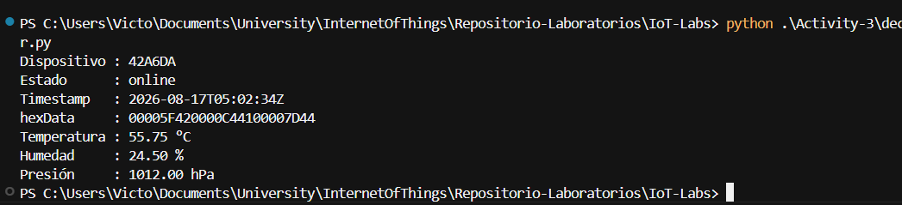

# Actividad 3 — Decodificador de hexData

Herramienta en Python que consume el endpoint público, filtra los objetos con `hexData` y decodifica el payload binario a temperatura, humedad y presión.

**Biblioteca para decodificar binarios:** `struct` (biblioteca estándar de Python).  
HTTP y JSON también van con biblioteca estándar: `urllib.request` y `json`.

## Código

El decodificador está en [`Activity-3/decoder.py`](Activity-3/decoder.py). Hace un `GET` a `https://mpab3475e4567ee98b2d.free.beeceptor.com/data`, se queda solo con los objetos que tienen `hexData` y convierte los primeros 12 bytes en tres `float32` little-endian.

```bash
python .\Activity-3\decoder.py
```

El desempaquetado usa `struct`:

```python
temperatura, humedad, presion = struct.unpack_from("<fff", raw, 0)
```

| Campo        | Tipo    | Bytes | Endianness    |
|--------------|---------|-------|---------------|
| temperatura  | float32 | 0–3   | little-endian |
| humedad      | float32 | 4–7   | little-endian |
| presión      | float32 | 8–11  | little-endian |

## Capturas

Salida en consola (`python .\Activity-3\decoder.py`):



En esa corrida el payload `00005F420000C44100007D44` quedó en **55.75 °C**, **24.50 %** y **1012.00 hPa**. El mock cambia entre consultas; el formato de salida se mantiene.

## Explicación del proceso de decodificación: conversión de hex a bytes y desempaquetado

1. Consumo el JSON con `urllib.request`. La API devuelve un **array**, así que recorro la lista y descarto cualquier objeto sin `hexData`.
2. Limpio el string hexadecimal (espacios) y lo paso a bytes con `bytes.fromhex`. Dos caracteres hex = 1 byte, así que 24 caracteres son 12 bytes.
3. Compruebo que haya al menos 12 bytes. Si el hex es inválido o el payload es corto, el error va a stderr.
4. Con `struct.unpack_from("<fff", raw, 0)` interpreto esos 12 bytes como tres `float32` little-endian: temperatura, humedad y presión.
5. Imprimo dispositivo, estado, timestamp, el `hexData` original y los tres sensores.

Ejemplo del payload de la captura:

```text
00005F42  0000C441  00007D44
   temp      hum      pres
```

`<fff` significa tres floats de 32 bits, little-endian. En little-endian `00005F42` se lee como `0x425F0000` → 55.75.

## Reflexión sobre el procesamiento de datos binarios en sistemas IoT

**¿Cómo identificaron el formato correcto del dato (float 32 bits, little-endian)?**  
Lo dio el enunciado: tres `float32` little-endian, 4 bytes cada uno, 12 bytes en total. En `struct` eso es `"<fff"`: `<` = little-endian y `f` = float de 32 bits. Lo verifiqué con el `hexData` de ejemplo `000071420000DC4100407F44`, que desempaqueta a 60.25 °C, 27.50 % y 1021.00 hPa. Si hubiera usado big-endian (`>fff`) los valores salían absurdos.

**¿Qué problemas enfrentaron con la decodificación y cómo los resolvieron?**  
Al correr el script desde la carpeta padre, Python no encontraba `Activity-3/decoder.py`; había que ejecutarlo desde `IoT-Labs`. En la consola de Windows, `°C` y `Presión` se veían rotos por la codificación; lo resolví reconfigurando stdout a UTF-8. También filtré solo objetos con `hexData`, porque el enunciado pide ignorar el resto, y validé longitud e hex antes de `unpack` para no romper el script con un payload corto.

**¿Por qué es importante conocer el formato de datos al integrar sistemas IoT?**  
El dispositivo envía bytes crudos, no JSON con nombres de campo. Sin saber tipo, tamaño y endianness, los mismos 12 bytes se leen como otra temperatura, otra humedad u otra presión. En IoT (Sigfox, LoRa, BLE) el payload es corto a propósito: hay que pactar el layout entre firmware y backend. Si no, el sistema “funciona” pero muestra datos falsos.

## Video
