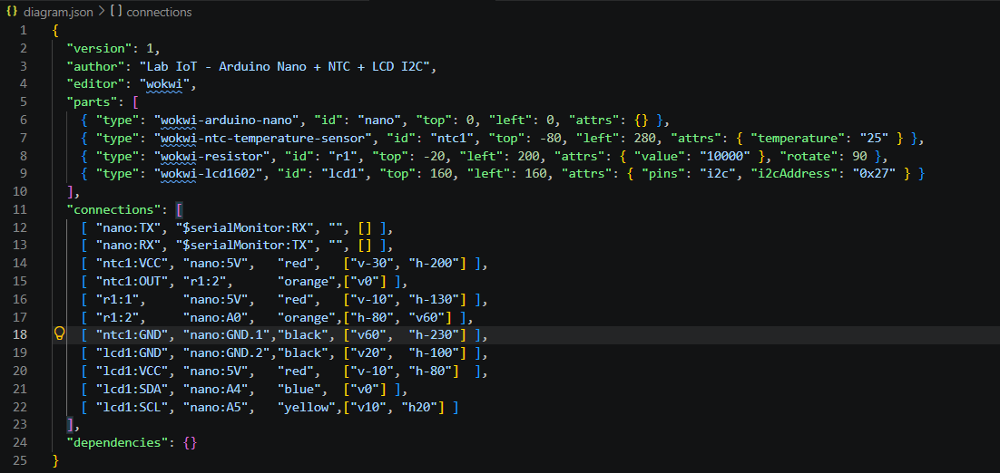
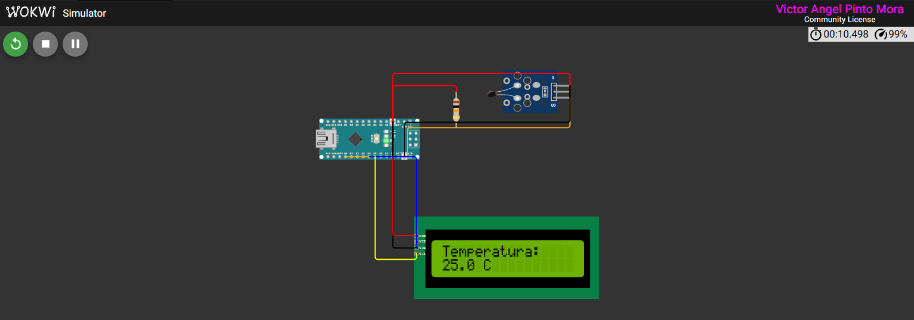
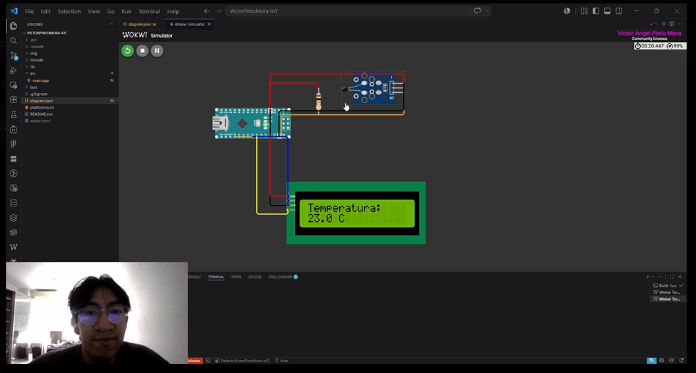

# Actividad: Sensor de Temperatura con LCD I2C

Este proyecto demuestra el uso de un sensor NTC para medir la temperatura y mostrar el valor en un display LCD I2C.

## Descripción

El programa lee la señal analógica desde un termistor NTC conectado a A0, calcula la temperatura en grados Celsius usando la ecuación Beta y muestra el resultado en el LCD I2C de 16x2. Además, envía la lectura al monitor serial a 9600 baudios.

## Componentes

- Placa Arduino compatible (Nano, Uno, etc.)
- Sensor NTC de 10 kΩ
- Resistencia fija de 10 kΩ (para el divisor de tensión)
- Pantalla LCD I2C 16x2 (dirección `0x27`)
- Cables de conexión

## Conexiones

### NTC y divisor de tensión

- NTC: un extremo a `5V`, el otro extremo al pin `A0`
- Resistencia fija 10 kΩ: un extremo a `A0`, el otro a `GND`

Esto crea un divisor de tensión donde la lectura analógica en `A0` depende de la temperatura.

### LCD I2C

- `GND` -> `GND`
- `VCC` -> `5V`
- `SDA` -> `A4` (o el pin SDA de tu placa)
- `SCL` -> `A5` (o el pin SCL de tu placa)

> Nota: el proyecto usa la dirección I2C `0x27`. Si tu módulo tiene otra dirección, ajústala en `src/main.cpp`.

## Software

El código principal se encuentra en `src/main.cpp`.

- `LiquidCrystal_I2C` para controlar el LCD I2C
- `analogRead(A0)` para leer el valor del sensor NTC
- Conversión de la resistencia NTC a temperatura usando la constante `BETA`

## Configuración de PlatformIO

El archivo `platformio.ini` está configurado para una placa `nanoatmega328new` con el framework Arduino y la librería:

```ini
lib_deps =
    marcoschwartz/LiquidCrystal_I2C
```

## Uso

1. Conecta los componentes según el diagrama de conexiones.
2. Abre el proyecto en PlatformIO.
3. Compila y sube el código a la placa.
4. Abre el monitor serial a `9600` baudios para ver las lecturas.
5. Observa la temperatura en el LCD y en el monitor serial.

## Resultado esperado

- El LCD muestra una primera línea fija con `Temperatura:`.
- La segunda línea muestra el valor actual en grados Celsius.
- El monitor serial imprime mensajes como:

```
Temperatura: 24.3 C
```

## Ajustes

Puedes cambiar estos valores en `src/main.cpp`:

- `BETA`: coeficiente Beta del NTC
- `R0`: resistencia nominal a 25°C
- `R_FIXED`: resistencia del divisor de tensión
- `NTC_PIN`: pin analógico donde se conecta el termistor

## Capturas





## Demo Video



[Ir al video](https://drive.google.com/drive/folders/1DuEENFiGhsPQ8bfkrApgRG3ui8Knil6r?usp=sharing)
